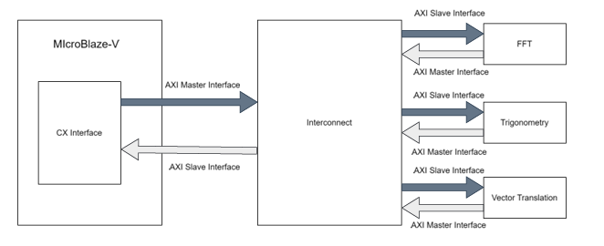
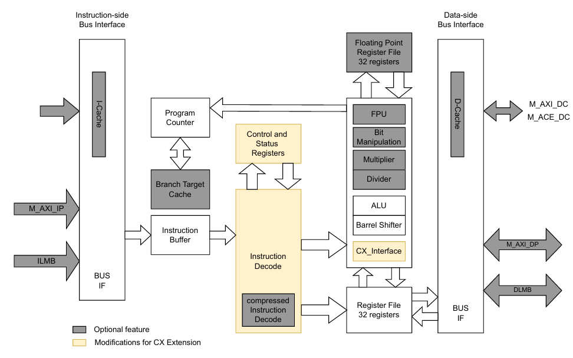
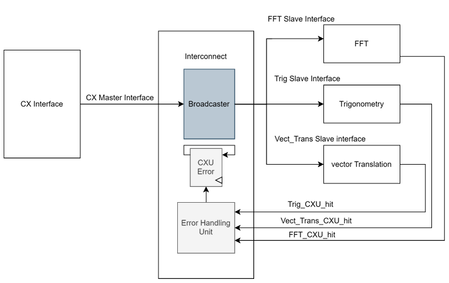
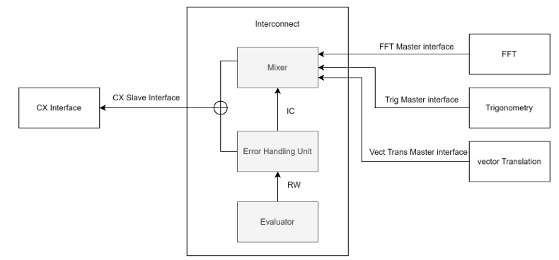
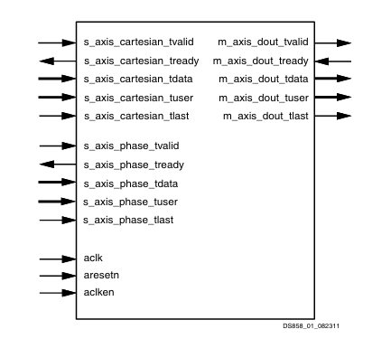
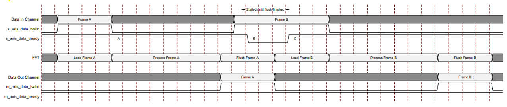
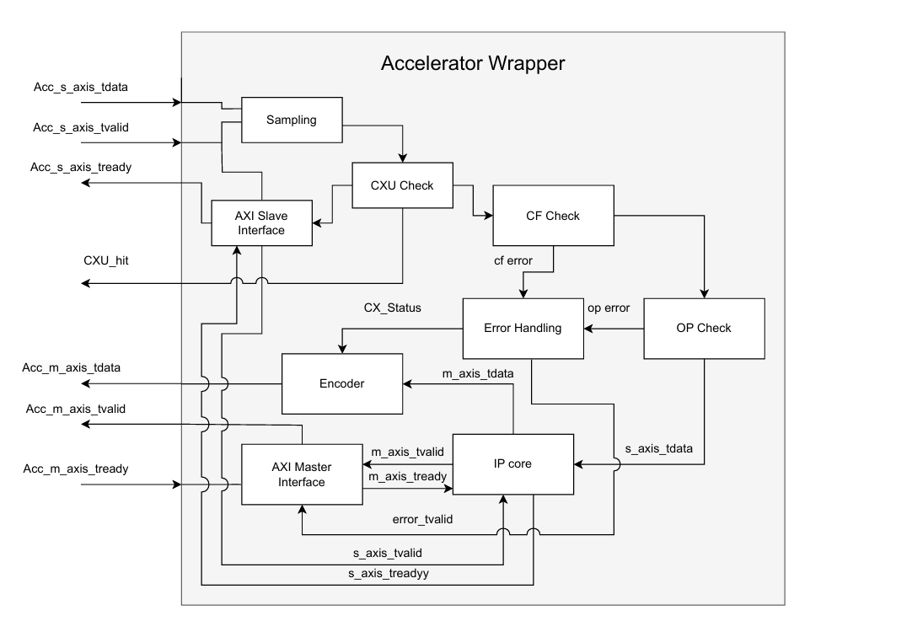
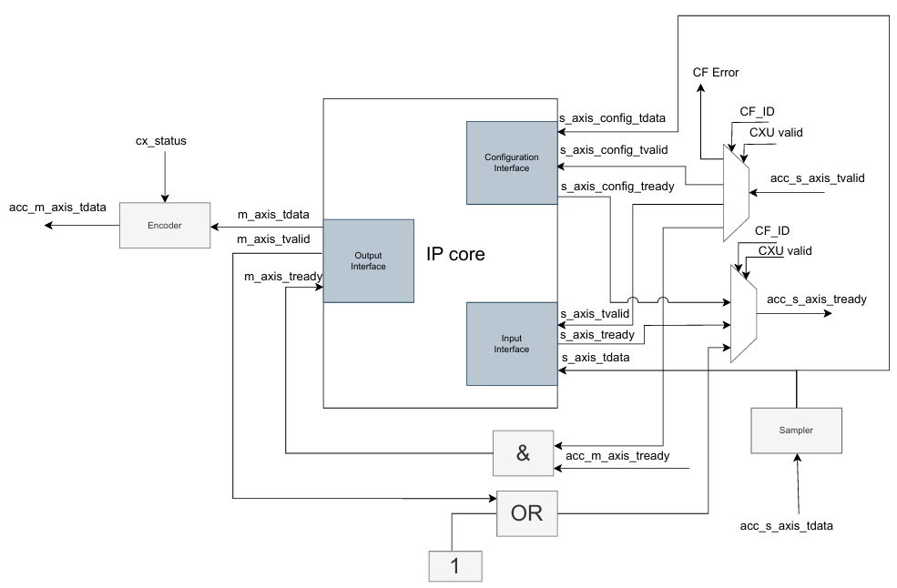

# Design Overview — Composable Extension (CX) Integration in MicroBlaze-V

This document explains the architectural design of the **Composable Extension (CX)** framework implemented in the **MicroBlaze-V RISC-V soft-core**.  
It provides a detailed description of each hardware component, its purpose, and its interaction within the system.  

## 1 - System Architecture

The CX framework extends the MicroBlaze-V processor by introducing a **Composable Extension Interface** that allows the integration of multiple hardware accelerators.  
It enables the CPU to issue **custom instructions** through the CX interface, which are routed to the appropriate **Composable Extension Unit (CXU)** via a shared **AXI4-Stream interconnect**.

*Top-Level CX Integration Architecture*  

**Main design modules:**
- CX Interface (integrated into MicroBlaze-V)
- CX Interconnect
- Wrapper modules for accelerators
- Hardware accelerators (FFT, CORDIC)
- CSR extensions for CX configuration and status

---

## 2 - MicroBlaze-V
In order to support the CX extension, MicroBlaze-V was modified with an interface for custom instruction execution, additional CSRs and pipeline modifications.

*Updated MicroBlaze-V architecture supporting CX extension:*

### CX-Interface
The CX interface designed in MicroBlaze-V handles the execution of custom instructions through a series of the following operations

*CX interface functions*

### **Functionality**
- Version Check: Ensures the MicroBlaze-V version matches the version of the CX extension
- Data Ending: Encodes CXU_ID, CF_ID, and operand values for the AXI master payload.
- Transmission of AXI-Stream, stall the pipeline in case of write-back, else continue the pipeline 
- Receives the response and decodes the result and status of execution.
- Updates the registers and the CSRs

### CSR: Control and Status Register

### **mxc_selector (CSR Address: 0xBC0)**
The `mcx_selector` CSR enables **Composable Extension (CX) multiplexing**, allowing developers to select the corresponding **Composable Extension Unit (CXU)** required to execute a particular custom instruction. 

*Instruction format:*

### ** cx_status (CSR Address: 0xBC1)**
The `cx_status` CSR is used to **accumulate CXU error flags** and monitor the status of accelerator operations.  

*Instruction format:*

- IV: Invalid CX version error
- IC: Invalid CXU_ID error
- IS: Invalid STATE_ID error
- OF: State is off error
- IF: Invalid CF_ID error
- OP: CXU operation error
- CU: Custom CXU operation error

---

## 3 - CX Interconnect
The interconnect has been designed to act as a bridge between the MicroBlaze-V core and the accelerators. Interconnect has two phases of execution: the write phase and the read phase.

### - Write Phase
The write phase of the interconnect contains the broadcaster, error handling unit, and CXU Error accumulator
- Broadcaster: Manages the transfer of AXI-stream from MicroBlaze-V to the accelerators
- Error handling unit: Manages the CXU error in case of mismatch in the CXU identifiers or if the accelerator is missing

*CX Interconnect Write Phase* 

### - Read Phase
The Read phase of the interconnect contains the mixer, evaluator, and error handling unit.
- Mixer: Manages the AXI stream containing the result and the status to be updated in the CSR (data path).
- Evaluator: Manages Write-back to the processor (control path).
  
*CX Interconnect Read Phase*  

---

### - IP core configuration
Two existing Xilinx IP cores were integrated as accelerators:
- **FFT Core** — computes Fast Fourier Transform.
- **CORDIC Core** — performs trigonometric and vector operations.
  
> **Note:**  
> In our system, IP cores function as independent accelerator units, each assigned a unique identifier. The execution of every IP core is controlled through distinct instruction formats.

### **CORDIC**
 The CORDIC IP core can be used to implement many different mathematical func
tions, including trigonometric functions, square root, hyperbolic and also rectangular
polar conversions. The respective function can be configured in the IP core and the
 operands can be selected accordingly, whether it is a phase or Cartesian operand.
The detailed information can be found in AMD's official documentation: 
 
*CORDIC PIN diagram*  

#### CORDIC IP Core Configuration Comparison

| Parameter                             | Vector Configuration | Trigonometric Configuration |
|--------------------------------------|-----------------------|-----------------------------|
| Function                              | Vector                | Trigonometric               |
| Input Width                           | 16 bits               | 16 bits                     |
| Phase Width                           | 16 bits               | 16 bits                     |
| Output Width                          | 16 bits               | 16 bits                     |
| Data Format                           | Signed Fractional     | Signed Fractional           |
| Rounding Mode                         | Truncate              | Truncate                    |
| Iterations                            | 16                    | 16                          |
| Pipelining                            | Maximum               | Maximum                     |
| Scale Compensation                    | Enabled               | Enabled                     |
| Angle Format                          | Radians               | Radians                     |
| Cordic Function Type                  | Vector                | Rotation                    |
| Implementation Architecture            | Parallel              | Parallel                    |
| Phase Quantization                    | Enabled               | Enabled                     |
| Latency                               | 16 cycles             | 16 cycles                   |

### **FFT**

The FFT IP core was configured to have independent stages to configure, write, and read.
Each stage will be managed by unique instruction formats with the same CXU ID.

#### FFT IP Core Configuration:

| Parameter                              | FFT Configuration Value     |
|---------------------------------------|-----------------------------|
| Function                              | FFT                         |
| Architecture Type                     | Burst I/O                   |
| Implementation Architecture            | Radix-2                     |
| Transform Length                      | 256                         |
| Number of Stages                      | 8                           |
| Input Width                           | 16 bits                     |
| Output Width                          | 16 bits                     |
| Phase Factor Width                    | 16 bits                     |
| Data Format                           | Signed Fractional           |
| Scaling Option                        | Scaled                      |
| Rounding Mode                         | Truncate                    |
| Butterfly Type                        | Radix-2                     |
| Scale Compensation                    | Enabled                     |
| Phase Quantization                    | Enabled                     |
| Latency                               | Dependent on 8 pipeline stages |
| Throughput                            | Moderate                    |
| Resource Utilization                  | Medium                      |

#### FFT Timing Diagram:

## IP core wrapper

 ### **Wrapper Module Functions**

- Manages the execution of custom instructions for each IP core.  
- Samples and verifies incoming data (`tvalid`, `tdata`) for integrity.  
- Validates `CXU_ID` and determines **CXU hit** or **mismatch**.  
- Forwards parameters to the IP core after **CF_ID** and **operand** checks.  
- Handles errors and sends appropriate responses to **MicroBlaze**.  
- Waits for the IP core to complete computation and encodes the result with status.  
- Connects IP cores via **AXI master/slave interfaces** to manage handshake and data signals.  
- Supports **write-back** operations for instructions expecting a result.  
- Skips result write-back for instructions not requiring output.  
- Accumulates and reports **CF** and **operand error** statuses during read operations.

*Wrapper functions*

### **CORDIC IP Wrapper Functions**
- Executes **read instructions** from MicroBlaze.  
- Waits for the IP core to complete computation.  
- Collects and returns the computed result.  

---

### **FFT IP Wrapper Functions**
- Manages three distinct phases of FFT operation.  
- Includes **additional control logic** to handle these phases efficiently.  
- Performs extra functions to coordinate data flow and synchronization between phases.  
- Ensures correct sequencing of input, computation, and output stages.  

## Summary

The design successfully extends MicroBlaze-V with a **scalable CX interface** that allows seamless integration of multiple accelerators.  
Through AXI4-Stream interconnect and standardised CSR mapping, the framework achieves:
- Modularity  
- Scalability  
- Low-latency communication between CPU and accelerators  

This framework serves as a foundation for **future RISC-V SoC designs** supporting composable hardware acceleration.

---

© 2025 — CX Integration for MicroBlaze-V | Chalmers University of Technology & AMD Collaboration
